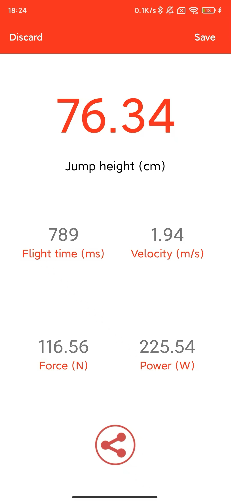

# JumpVision
JumpVision是一个基于机器视觉的项目，用于从视频片段中估计个人的跳跃高度和悬挂时间。通过分析从固定摄像机角度拍摄的视频，该系统可以跟踪关键的身体点，并使用基于物理的计算来确定跳跃性能。
## 语言
* [ENGLISH](README.md)
* [中文](README-zh.md)
## 特点
- 📹 **基于视频的测量**：使用计算机视觉分析跳跃运动。
- 🎯 **准确的跳跃高度估计**：根据身体关键点跟踪计算垂直跳跃。
- ⏱ **悬挂时间计算**：确定跳跃的总播放时间。
- 📊 **数据可视化**：绘制运动曲线和关键参数，以便更好地进行分析。
## 安装
```sh
git clone https://github.com/SportsCV/JumpVision.git
cd JumpVision
pip install -r requirements.txt
```
## 使用方法
1. 将跳转尝试的视频文件作为“demo.mp4”放置在项目目录中。
2. 运行分析脚本：
```shell
python main.py
```
3. 查看输出跳跃高度和滞空时间。

> 78.71cm


4. 对比 MY-JUMP-LAB APP

> 76.34cm


## 它是如何工作的
1. 关键点检测：使用姿势估计模型来跟踪脚踝位置。
2. 跳跃分割：过滤帧以提取跳跃相位。
3. 抛物线拟合：应用二次函数来估计跳跃高度。
4. 基于物理的计算：计算总悬挂时间和垂直跳跃。