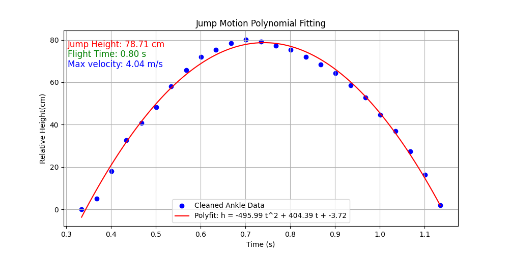

# JumpVision

JumpVision is a machine vision-based project for estimating an individual's jump height and hang time from video footage. By analyzing videos captured from a fixed camera angle, the system can track key body points and use physics-based calculations to determine jump performance.
## Languages
* [ENGLISH](README.md)
* [中文](README-zh.md)

## Features
- 📹 **Video-based measurement**: Uses computer vision to analyze jump motion.
- 🎯 **Accurate jump height estimation**: Calculates vertical leap based on body keypoint tracking.
- ⏱ **Hang time calculation**: Determines the total air time of the jump.
- 📊 **Data visualization**: Plots motion curves and key parameters for better analysis.

## Installation
```sh
git clone https://github.com/SportsCV/JumpVision.git
cd JumpVision
pip install -r requirements.txt
```
## Usage
1.	Place a video file of a jump attempt in the project directory as `demo.mp4`.
2. Run the analysis script:
```shell
python main.py
```
3. View the output jump height and hang time.


## How It Works
1. Keypoint Detection: Uses a pose estimation model to track the ankle position.
2. Jump Segmentation: Filters the frames to extract the jump phase.
3. Parabolic Fitting: Applies a quadratic function to estimate jump height.
4. Physics-based Calculation: Computes the total hang time and vertical leap.
